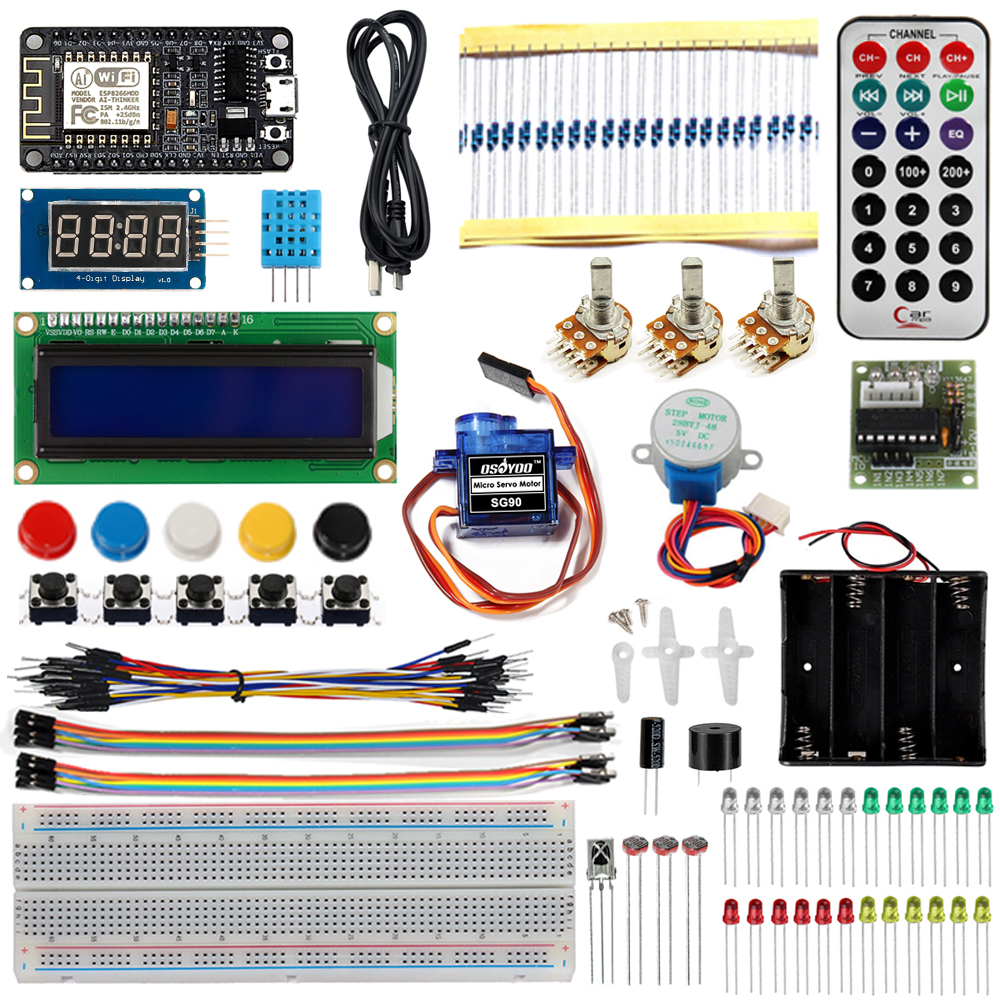
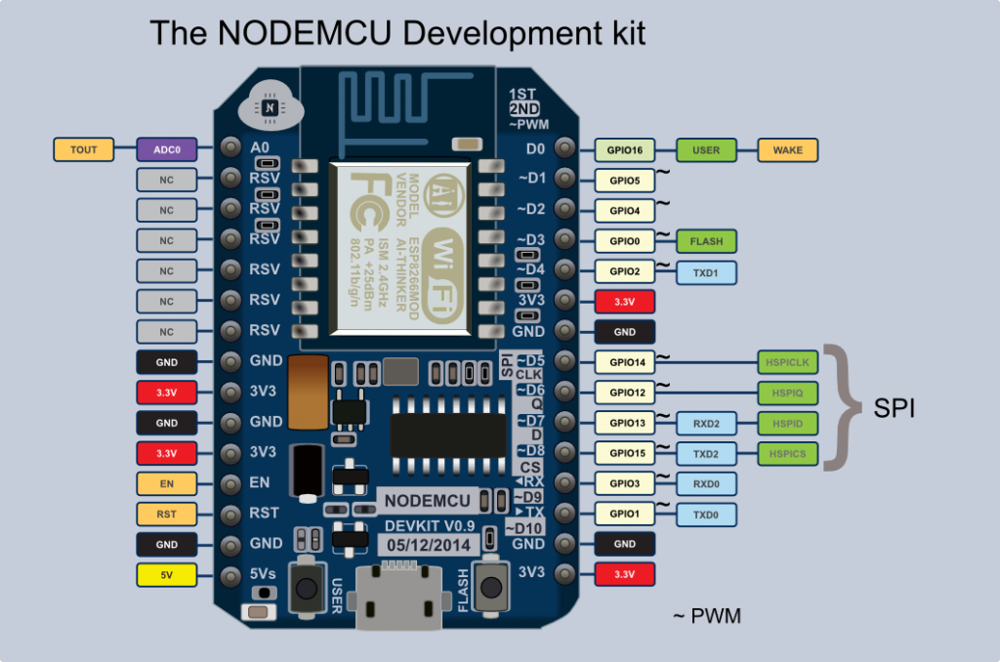
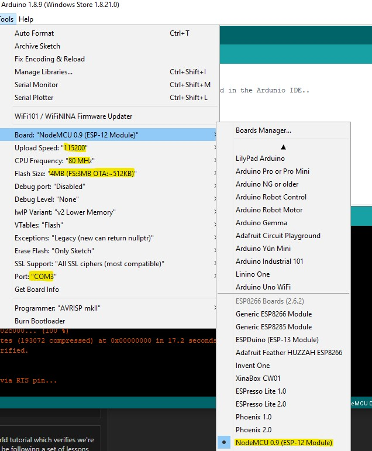

# nodemcu-iot-starter-kit
An implementation of some of the code samples provided from the Osoyoo NodeMCU Starter Kit.

* I've realized that the main project to run the Arduino SDK on the ESP8266 is located [here on Github](https://github.com/esp8266/Arduino).

# Resources

1. [The Osoyoo.com Starter Kit Overview](https://osoyoo.com/2017/05/07/osoyoo-nodemcu-iot-programming-learning-starter-kit/#3)

## Lesson 1 - Install the ESP8266 Board Package and the Serial Port Driver

So what I realized quickly is that the ESP8266 that I purchased comes pre-flashed with a Lua interpreter onboard. Almost all tutorials are telling me that we should go ahead and flash it so we can use the Arduino IDE. 

> **NOTE**: This action is writing directly to the firmware, erasing the NodeMCU firmware. We can always flash it back to the old Lua SDK if we want.

Instructions are located [here](https://osoyoo.com/2017/05/09/nodemcu-lesson-1-hello-worldconfig-the-ide-and-start-your-first-project/). 

* I spent a few minutes determining what drivers to download. I've gone ahead and placed them into the `/drivers` directory. When you unzip this, just run the `.exe` installer.
* The Arduino IDE looks like it can be built or downloaded via the Windows 10 store. 

1. Connect your NodeMCU to the Computer
2. Install the COM/Serial port driver
3. Install the [Arduino IDE 1.6.4 or greater](https://www.arduino.cc/en/Main/Software)
4. Install the ESP8266 Board Package
    * Enter `http://arduino.esp8266.com/stable/package_esp8266com_index.json` into Additional Board Manager URLs field in the Arduino v1.6.4+ preferences (Open Arduino IDE–>File–>Preferences–>Settings).

Step 4 is where we actually flash the controller with the new board package. This was done using the Board Manager feature of the Arduino IDE.

Once everything was setup, I simply followed the rest of the instructions which have us print out the infamous `Hello World!` prompt via our micro-controller.

To do this, open up Arduino IDE and set the following config values

* CPU Frequency：`80MHz`
* Flash Size：`4MB（FS: 3MB OTA: ~512KB)`
* Upload Speed：`115200`
* Port: *Select your Port* - mine was `COM3`

